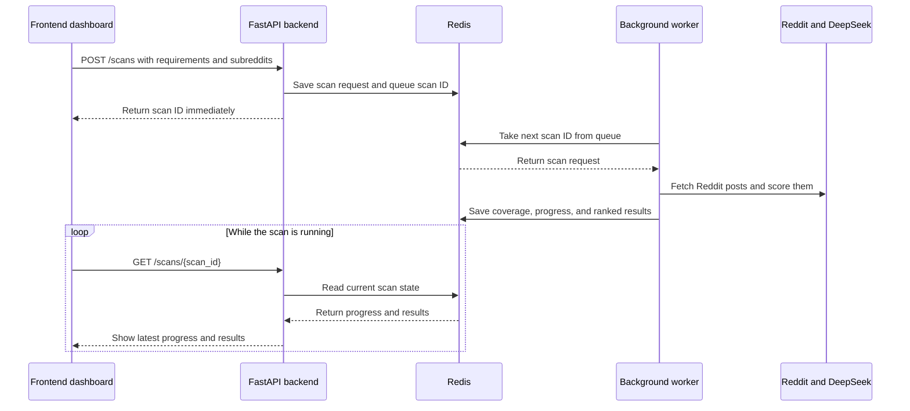

# Sift Dashboard

A full-stack version of Sift: a FastAPI backend (Python) that does the
fetching/interpreting/scoring, and a Next.js frontend (React + TypeScript
+ Tailwind) that gives you an actual UI to drive it.

## Structure

```
sift-app/
  backend/     FastAPI API - interpret + score endpoints
  frontend/    Next.js dashboard - input, subreddit review, results table
```

## Backend setup

```bash
cd backend
python3 -m venv venv
source venv/bin/activate
pip install -r requirements.txt

export DEEPSEEK_API_KEY="your-key-here"
export REDDIT_USER_AGENT="python:sift:v1.0 (by /u/your_reddit_username)"

uvicorn main:app --reload --port 8000
```

Leave this running in its own terminal tab. Visit
`http://localhost:8000/docs` to see the interactive API docs FastAPI
generates automatically.

## Frontend setup

In a **second** terminal tab:

```bash
cd frontend
npm install
npm run dev
```

Visit `http://localhost:3000` - that's the actual dashboard.

## Docker setup

Docker runs the frontend, backend, Redis queue, and scoring worker together,
so you do not need to
activate the Python virtual environment or run the Next.js server manually.

Create the local environment file once and fill in your real values:

```bash
cp .env.example .env
```

Build and start both services:

```bash
docker compose up --build
```

Visit `http://localhost:3000`. The backend health endpoint remains available
at `http://localhost:8000/health`.

When a scan starts, the API immediately returns a scan ID. Redis queues that
scan for the worker, the worker fetches and scores posts in the background,
and the dashboard polls the API to show progress and incremental results.

Stop the stack with `Ctrl+C`, or from another terminal run:

```bash
docker compose down
```

## Local Kubernetes setup

The manifests in `k8s/` run the same Sift architecture under Kubernetes:

- a frontend Deployment and internal Service
- a backend Deployment and internal Service
- a worker Deployment
- a Redis StatefulSet, Service, and persistent volume claim
- a ConfigMap for non-secret settings
- a locally created Secret for API credentials

The backend and worker use the same `sift-backend:rss-cache-v3` image. Kubernetes
starts that image with the FastAPI command for the backend and with
`python worker.py` for the worker.

### 1. Enable a local cluster

These instructions use Kubernetes included with Docker Desktop. In Docker
Desktop, open **Settings > Kubernetes**, enable Kubernetes, and wait for it to
finish starting. Confirm the context is available:

```bash
kubectl config use-context docker-desktop
kubectl cluster-info
```

### 2. Stop Compose and build local images

Compose and Kubernetes cannot both bind the same local ports. Stop the Compose
stack, then build the two Sift images Kubernetes uses:

```bash
docker compose down
docker build -f backend/Dockerfile -t sift-backend:rss-cache-v3 .
docker build \
  -f frontend/Dockerfile \
  -t sift-frontend:rss-cache-v3 \
  --build-arg NEXT_PUBLIC_API_BASE_URL=http://localhost:8000 \
  .
```

### 3. Create the namespace and secret

Create the namespace first. Then create `sift-secrets` from the local `.env`
file. The generated Secret is sent directly to Kubernetes and is not saved in
Git:

```bash
kubectl apply -f k8s/namespace.yaml
kubectl create secret generic sift-secrets \
  --namespace sift \
  --from-env-file=.env \
  --dry-run=client -o yaml | kubectl apply -f -
```

### 4. Deploy Sift

```bash
kubectl apply -k k8s
kubectl get pods -n sift --watch
```

Wait until the frontend, backend, worker, and Redis pods show `Running`. Press
`Ctrl+C` to stop watching; this does not stop the pods.

### 5. Open the dashboard

Use two terminal tabs to forward the Kubernetes Services to the same local
addresses used by the frontend build:

```bash
kubectl port-forward --namespace sift service/backend 8000:8000
```

```bash
kubectl port-forward --namespace sift service/frontend 3000:3000
```

Open `http://localhost:3000`. Useful inspection commands are:

```bash
kubectl get all -n sift
kubectl logs -n sift deployment/worker --follow
kubectl describe pod -n sift <pod-name>
```

Remove the local Kubernetes deployment with:

```bash
kubectl delete namespace sift
```

Deleting the namespace also deletes the local Redis volume claim and its scan
data. The later AWS/EKS deployment should replace the in-cluster Redis instance
with a managed Redis service and use registry-hosted images instead of the
local development image tags.

### Production direction

The local manifests deliberately preserve the same service boundaries intended
for production, but they are not themselves a complete production deployment.
The AWS/EKS version should add:

- immutable frontend and backend image tags stored in Amazon ECR
- Amazon ElastiCache instead of the single in-cluster Redis pod
- PostgreSQL in Amazon RDS for users, credits, and permanent scan history
- secrets delivered from AWS Secrets Manager rather than a local `.env` file
- an HTTPS Ingress, DNS, certificates, and production CORS configuration
- at least two frontend/backend replicas, autoscaling, and disruption budgets
- network policies, centralized logs, metrics, alerts, backups, and CI/CD

This separation lets the local setup teach and validate Kubernetes concepts
without pretending that a single-node Redis instance or local image tag is a
production-grade dependency.

## How it works

### Background scan flow



Redis has two responsibilities in this flow:

1. **Scan queue:** it holds scan IDs until the worker is available to process
   them.
2. **Temporary scan state:** it stores the request, status, coverage, progress,
   and results so the separate backend and worker containers can access the
   same information.

Redis does not fetch Reddit posts or calculate relevance scores. The worker
does that work. Redis connects the API request to the background worker and
keeps the latest state available for the dashboard.

1. **Input** - type a free-form description of what you're trying to find
   (no need to separately specify a "domain" or "rubric" - the backend
   derives both from your text).
2. **Subreddit review** - the backend suggests candidate subreddits based
   on your description. Add, edit, or remove any before continuing. Common
   forms such as `relationships`, `r/relationships`, and Reddit URLs are
   normalized automatically.
3. **Results** - the backend fetches recent posts from each subreddit via
   RSS, scores every one against the derived rubric, and the dashboard
   shows a ranked table: score, title, reason, link.

## Notes

- Both servers need to be running at the same time (backend on :8000,
  frontend on :3000) for the dashboard to work.
- The DeepSeek API key only ever lives on the backend - it's never sent
  to or stored in the browser.
- A Phase 1 scan is intentionally limited to 5 subreddits and 5 posts per
  subreddit. This keeps response time and model cost predictable while the
  relevance workflow is being validated.
- Reddit may rate-limit RSS traffic. Sift spaces feed requests and retries
  HTTP 429 responses with a shared cooldown. Successful feeds are cached in
  Redis for 15 minutes and kept as a stale fallback for one hour, so repeated
  scans reuse posts instead of repeatedly contacting Reddit. Set
  `REDDIT_USER_AGENT` to a descriptive value containing your Reddit username.
- RSS access is still not guaranteed. On the first HTTP 429, every worker
  observes a shared 10-minute cooldown; subreddits with cached posts continue
  from that cache, while uncached subreddits return a warning without making
  additional Reddit requests. New RSS requests are globally spaced at least
  60 seconds apart.
- Set `NEXT_PUBLIC_API_BASE_URL` for a non-local backend. Set the backend's
  comma-separated `SIFT_ALLOWED_ORIGINS` variable for non-local frontends.
- Scan state is stored temporarily in Redis for 24 hours. The Docker Redis
  volume preserves it across ordinary container restarts, but the dashboard
  does not yet provide permanent scan history. Long-term persistence,
  scheduling, and push notifications are later phases.
