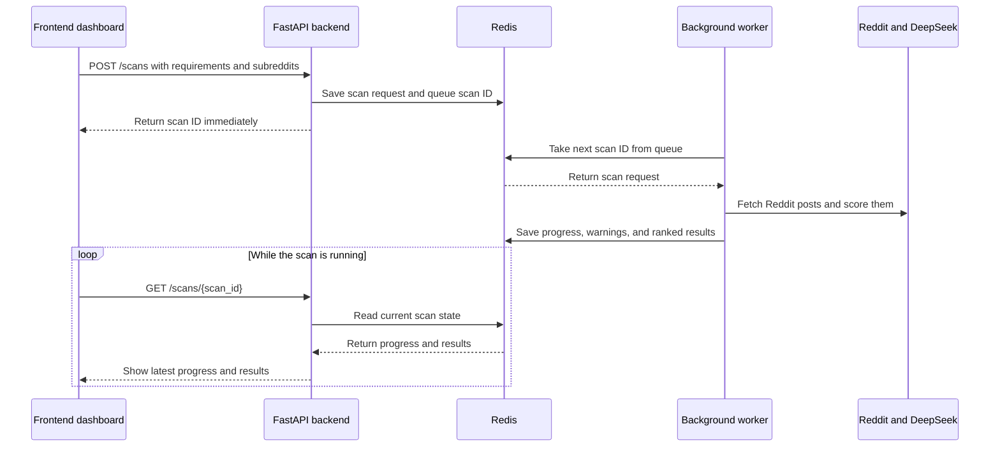

# Sift Dashboard

A full-stack version of Sift: a FastAPI backend (Python) that does the
fetching/interpreting/scoring, and a Next.js frontend (React + TypeScript
+ Tailwind) that gives you an actual UI to drive it.

## Structure

```
sift-app/
  backend/     FastAPI API - interpret + score endpoints
  frontend/    Next.js dashboard - input, subreddit review, results table
```

## Backend setup

```bash
cd backend
python3 -m venv venv
source venv/bin/activate
pip install -r requirements.txt

export DEEPSEEK_API_KEY="your-key-here"
export REDDIT_USER_AGENT="python:sift:v1.0 (by /u/your_reddit_username)"

uvicorn main:app --reload --port 8000
```

Leave this running in its own terminal tab. Visit
`http://localhost:8000/docs` to see the interactive API docs FastAPI
generates automatically.

## Frontend setup

In a **second** terminal tab:

```bash
cd frontend
npm install
npm run dev
```

Visit `http://localhost:3000` - that's the actual dashboard.

## Docker setup

Docker runs the frontend, backend, Redis queue, and scoring worker together,
so you do not need to
activate the Python virtual environment or run the Next.js server manually.

Create the local environment file once and fill in your real values:

```bash
cp .env.example .env
```

Build and start both services:

```bash
docker compose up --build
```

Visit `http://localhost:3000`. The backend health endpoint remains available
at `http://localhost:8000/health`.

When a scan starts, the API immediately returns a scan ID. Redis queues that
scan for the worker, the worker fetches and scores posts in the background,
and the dashboard polls the API to show progress and incremental results.

Stop the stack with `Ctrl+C`, or from another terminal run:

```bash
docker compose down
```

## How it works

### Background scan flow



Redis has two responsibilities in this flow:

1. **Scan queue:** it holds scan IDs until the worker is available to process
   them.
2. **Temporary scan state:** it stores the request, status, progress, warnings,
   and results so the separate backend and worker containers can access the
   same information.

Redis does not fetch Reddit posts or calculate relevance scores. The worker
does that work. Redis connects the API request to the background worker and
keeps the latest state available for the dashboard.

1. **Input** - type a free-form description of what you're trying to find
   (no need to separately specify a "domain" or "rubric" - the backend
   derives both from your text).
2. **Subreddit review** - the backend suggests candidate subreddits based
   on your description. Add, edit, or remove any before continuing. Common
   forms such as `relationships`, `r/relationships`, and Reddit URLs are
   normalized automatically.
3. **Results** - the backend fetches recent posts from each subreddit via
   RSS, scores every one against the derived rubric, and the dashboard
   shows a ranked table: score, title, reason, link.

## Notes

- Both servers need to be running at the same time (backend on :8000,
  frontend on :3000) for the dashboard to work.
- The DeepSeek API key only ever lives on the backend - it's never sent
  to or stored in the browser.
- A Phase 1 scan is intentionally limited to 5 subreddits and 5 posts per
  subreddit. This keeps response time and model cost predictable while the
  relevance workflow is being validated.
- Reddit may rate-limit RSS traffic. Sift spaces feed requests and retries
  HTTP 429 responses with bounded backoff. Set `REDDIT_USER_AGENT` to a
  descriptive value containing your Reddit username.
- Set `NEXT_PUBLIC_API_BASE_URL` for a non-local backend. Set the backend's
  comma-separated `SIFT_ALLOWED_ORIGINS` variable for non-local frontends.
- Scan state is stored temporarily in Redis for 24 hours. The Docker Redis
  volume preserves it across ordinary container restarts, but the dashboard
  does not yet provide permanent scan history. Long-term persistence,
  scheduling, and push notifications are later phases.
